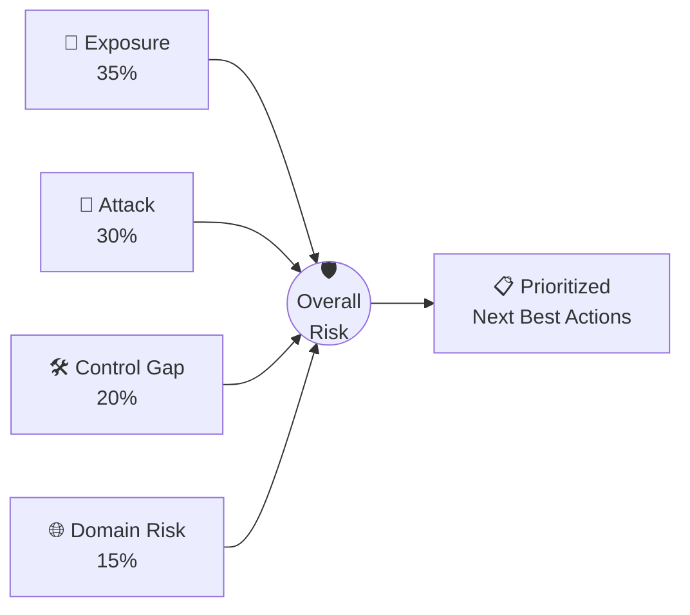

<div align="center">

# 🛡️ MailGuard Pro

### Email Attack Path Intelligence for Microsoft 365 & Google Workspace

*See how an attacker would actually reach your inboxes — and fix it before they do.*

<br>


<br>

[**🐧 Install on Linux**](INSTALL_LINUX.md) &nbsp;•&nbsp; [**🪟 Install on Windows**](INSTALL_WINDOWS.md) &nbsp;•&nbsp; [**✉️ Support**](mailto:support@mailguard.io)

</div>

---

## ✨ What is MailGuard?

MailGuard is the only platform that combines **topology-aware Attack Path Intelligence** with **Email Security Posture Management (ESPM)**. It connects to your Microsoft 365 or Google Workspace tenant **read-only**, maps how mail actually flows into your organization, and shows you — in plain language — the exact paths an attacker could use to land a phishing or spoofing email in a user's inbox.

No agents. No mail-flow changes. No risk to production. You connect, MailGuard reads your configuration, and you get a prioritized picture of your email risk in minutes.

> [!NOTE]
> MailGuard **never modifies** your tenant. Every permission it requests is read-only — it inspects configuration, it does not change it.

---

## 🎯 Why teams use it

| | |
|---|---|
| 🧭 **Attack Path Intelligence** | Visualizes real, topology-aware paths into your mailboxes — SEG bypass, direct-to-M365 bypass, missing inbound-connector enforcement. |
| 📊 **Email Security Posture Management** | Scores your posture against **SCuBA / CIS** benchmarks and surfaces every control gap with a clear "next best action." |
| 🔐 **Authentication coverage** | Full **DMARC / SPF / DKIM** and **MX** analysis — what's enforced, what's missing, and what it exposes you to. |
| 🌐 **Lookalike domain monitoring** | Continuously hunts typosquatted and brand-impersonation domains and tracks their DNS / MX / threat status. |
| 🤖 **AI posture summaries** | Optional plain-English risk briefings and remediation guidance (bring your own AI key). |
| 🏢 **Multi-tenant / MSP ready** | Manage many tenants from one instance, switch between them, each isolated. |

---

## 🧮 How the risk score works

Your overall risk is a weighted composite of four pillars:

| Pillar | Weight | What it measures |
|--------|:------:|------------------|
| 📨 **Exposure Score** | **35%** | Inbound exposure: authentication posture (DMARC/SPF/DKIM), MX configuration, gateway routing. |
| 🧭 **Attack Score** | **30%** | Topology-aware attack paths — gateway bypass, direct-to-cloud delivery, connector enforcement. |
| 🛠️ **Control Gap** | **20%** | Missing or misconfigured controls vs SCuBA/CIS, plus incident dwell time. |
| 🌐 **Domain Risk** | **15%** | Lookalike / impersonation domains registered against your brand and their live threat status. |



---

## 🔌 What it connects to

<table>
<tr>
<td valign="top" width="50%">

### Microsoft 365
`OAuth · Read-only · Admin consent`

- Exchange Online
- Microsoft Defender
- Entra ID
- Teams
- SharePoint

</td>
<td valign="top" width="50%">

### Google Workspace
`Service Account · Read-only · Super Admin`

- Gmail
- Admin Console
- Drive
- Alert Center
- 2-Step Verification

</td>
</tr>
</table>

---

## 🚀 Quick start

You need **Docker** and your **MailGuard Pro license key**. Pick your operating system — each guide is written for total beginners, step by step:

<div align="center">

### 👉 [🐧 **Linux setup guide**](INSTALL_LINUX.md) &nbsp;&nbsp;|&nbsp;&nbsp; [🪟 **Windows setup guide**](INSTALL_WINDOWS.md)

</div>

**The short version** (once Docker is installed and you're in the MailGuard folder):

```bash
# Linux / macOS
bash setup.sh        # asks for your license key + an admin password
docker compose pull
docker compose up -d
```

```powershell
# Windows (PowerShell)
.\setup.ps1          # asks for your license key + an admin password
docker compose pull
docker compose up -d
```

Then open **<http://localhost:8000>** and log in with the admin password you chose. 🎉

> [!TIP]
> The very first start takes 30–60 seconds while it downloads the database, sets up the schema, and verifies your license. That's normal.

---

## 🔗 Connecting your first tenant

After logging in, click **Connect** and choose **Microsoft 365** or **Google Workspace**. The in-app wizard does everything for you.

For Microsoft 365 you have two equally easy options:

- **One-Click (recommended):** the wizard gives you one setup script. Run it, sign in as a Microsoft 365 admin, and it prints three values to paste back. Then you connect just by signing in.
- **Manual:** same idea — run the script, paste the three values (Tenant ID, Client ID, Client Secret).

> [!IMPORTANT]
> The setup script can run in **Azure Cloud Shell** *or* in **Windows PowerShell on any PC** — they work identically. If your tenant has **no Azure subscription**, Cloud Shell won't open, so just run it in Windows PowerShell instead. The script installs everything it needs automatically.

---

## 🔄 Updating

When a new version ships you'll see a notice in the app. Updating keeps all your data:

```bash
docker compose pull
docker compose up -d
```

---

## 🏢 MSP / multi-tenant mode

Running MailGuard for multiple client organizations? In your `.env` set:

```env
MULTI_TENANT_MODE=true
AUTH_MODE=idp
```

Each client signs in with their own Microsoft or Google account and sees only their own data. Connect each tenant once, then switch between them from the tenant selector.

---

## 🆘 Quick troubleshooting

> [!WARNING]
> **The app container keeps restarting** — almost always the license key. Run `docker compose logs app | grep -i license` to see why, then re-run setup to re-enter it.

| Symptom | Fix |
|---------|-----|
| `denied` / `unauthorized` on `docker compose pull` | Your image is private — log in with the token we provided (see the install guide). |
| Port 8000 already in use | Set `PORT=8080` in `.env`, then `docker compose up -d` and use `:8080`. |
| Can't reach it from another computer | Open the firewall port and use the server's IP, not `localhost`. |
| "License has been revoked" | Contact support to restore access. |

Full troubleshooting lives in the [Linux](INSTALL_LINUX.md#if-something-goes-wrong) and [Windows](INSTALL_WINDOWS.md#-if-something-goes-wrong) guides.

---

<div align="center">

### Questions? We're here to help.

[](mailto:support@mailguard.io)

<sub>MailGuard Pro · Commercial software · © MailGuard. All rights reserved.</sub>

</div>
